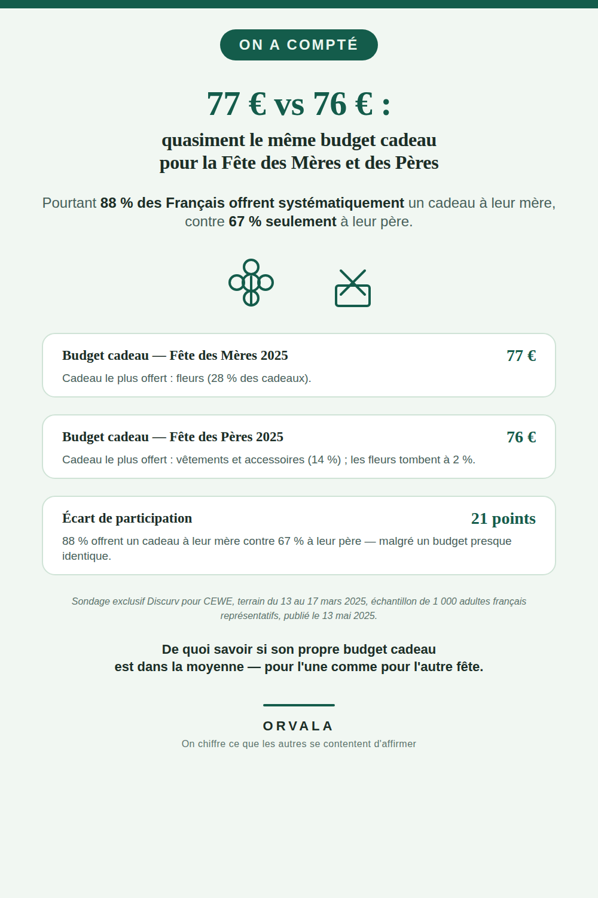

# Combien coûte la Fête des Mères et la Fête des Pères ?

**77 €** : c'est le budget cadeau moyen des Français pour la Fête des Mères 2025. **76 €** pour
la Fête des Pères 2025 — quasiment le même montant. Pourtant, **88 %** des Français déclarent
offrir systématiquement un cadeau à leur mère, contre **67 % seulement** à leur père : un écart
de **21 points** de participation malgré un budget presque identique.

## Ce qui est mesuré

| Indicateur | Chiffre |
|---|---|
| Budget cadeau moyen — Fête des Mères 2025 | **77 €** |
| Budget cadeau moyen — Fête des Pères 2025 | **76 €** |
| Offrent systématiquement un cadeau à leur mère | **88 %** |
| Offrent systématiquement un cadeau à leur père | **67 %** |
| Écart de participation | **21 points** |
| Cadeau le plus offert — Fête des Mères | **Fleurs — 28 %** |
| Cadeau le plus offert — Fête des Pères | **Vêtements et accessoires — 14 %** (fleurs : 2 %) |

## La source

Sondage exclusif **Discurv pour CEWE**, terrain du **13 au 17 mars 2025**, échantillon de
**1 000 adultes français représentatifs**, publié le **13 mai 2025**.

Pages sources vérifiées directement (WebFetch, 2026-08-10) :
- https://www.cewe.fr/blog/sondage-cewe-fete-des-meres-et-fete-des-peres-au-coeur-des-emotions-des-francais.html
  (source primaire)
- https://www.ecommercemag.fr/Thematique/etudes-1273/Breves/fete-meres-peres-budget-identique-480875.htm
  (confirme la méthodologie : terrain et échantillon)
- https://www.nlto.fr/consommation-budget-cadeau-fete-des-meres/
  (confirme la répartition par poste de cadeau)

Aucun chiffre de ce document n'a été recalculé ou extrapolé, à une exception : les « 21 points »
d'écart sont un calcul simple (88 − 67), pas une extension au-delà de ce que la source dit.

## Ce qui manque, honnêtement

La répartition en % par poste de cadeau ne totalise pas 100 % pour chaque fête : les sources ne
publient que les postes principaux (fleurs, vêtements/accessoires), pas la liste exhaustive.
Conformément à la règle de cette ligne éditoriale (« aucun chiffre inventé, jamais »), les postes
manquants ne sont ni estimés ni complétés.

Un article de Boursorama reprend le même chiffre de 77 € mais l'attribue à tort à « une étude
OpinionWay 2024 » — ce n'est pas la source utilisée ici, qui reste CEWE/Discurv (mai 2025).

## À propos

Ce dépôt accompagne une épingle Pinterest (compte `orvaladigital`) qui reprend ces chiffres pour
les rendre visibles à celles et ceux qui veulent situer leur propre budget cadeau par rapport à la
moyenne mesurée — pas pour donner un conseil d'économie.

## La série « On a compté »

Toute la série, avec un chiffre-titre par sujet : [github.com/VincentChabran](https://github.com/VincentChabran)

Ce dépôt fait partie d'une série qui chiffre et source ce que les autres se contentent d'affirmer, un sujet à la fois :

- [783 €/an pour un chien, 571 €/an pour un chat](https://github.com/VincentChabran/combien-coute-un-chien-un-chat)
- [19 293 €](https://github.com/VincentChabran/combien-coute-un-mariage)
- [environ 1 239,56 €](https://github.com/VincentChabran/combien-coute-un-demenagement)
- [488 €](https://github.com/VincentChabran/combien-coute-une-rentree-scolaire)
- [1 748 €](https://github.com/VincentChabran/combien-coutent-des-vacances-ete)
- [491 €](https://github.com/VincentChabran/combien-coute-noel)
- [490 €/mois](https://github.com/VincentChabran/combien-coute-un-bebe)
- [154 € (chez les couples qui la fêtent)](https://github.com/VincentChabran/combien-coute-la-saint-valentin)
- [85 € (étude 2024)](https://github.com/VincentChabran/combien-coute-halloween)
- [4 730 €](https://github.com/VincentChabran/combien-coute-des-obseques)
- [138 € à 344 €/mois de reste à charge selon le mode (2024)](https://github.com/VincentChabran/combien-coute-la-garde-d-enfant)
